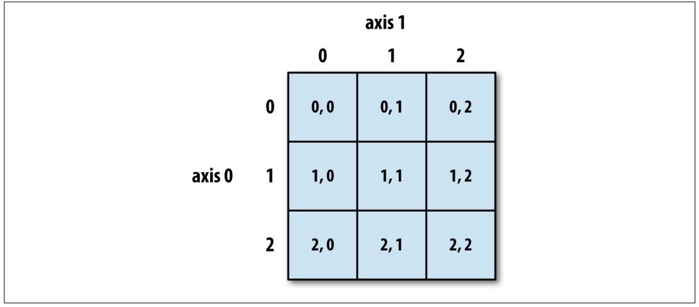
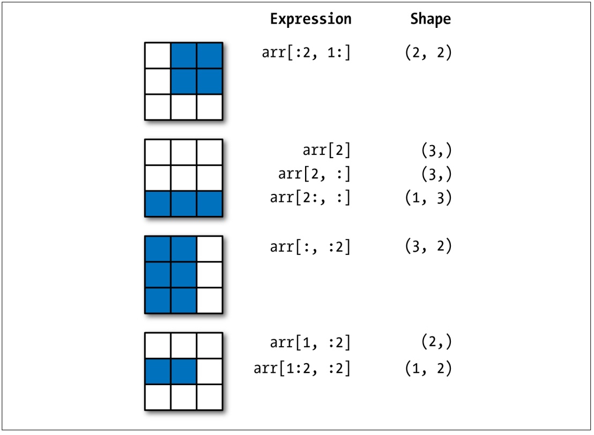


### 数组的索引运算

和 Python 中的列表类似，NumPy 的`ndarray`对象可以进行索引和切片操作，  
通过索引可以获取或修改数组中的元素，通过切片操作可以取出数组的一部分，我们把切片操作也称为切片索引。

#### 普通索引

类似于 Python 中`list`类型的索引运算。
```Python
import numpy as np
array19 = np.arange(1, 10)
print(array19[0], array19[array19.size - 1])  # 打印: 1 9
print(array19[-array19.size], array19[-1])    # 打印: 1 9

array20 = np.array([[1, 2, 3], [4, 5, 6], [7, 8, 9]])
print(array20[2])       # 打印: array([7, 8, 9])
print(array20[0][0])    # 打印: 1
print(array20[-1][-1])  # 打印: 9
print(array20[1][1])    # 打印: 5
# 下面这种下标的写法是原生python没有的，表示多维取值。`[1, 1]`跟`[1][1]`一样。
print(array20[1, 1])    # 打印: 5

# 设值
array20[1][1] = 10
print(repr(array20))
"""打印: 
array([[ 1,  2,  3],
       [ 4, 10,  6],
       [ 7,  8,  9]])
"""

array20[1] = [10, 11, 12]
print(repr(array20))
"""打印: 
array([[ 1,  2,  3],
       [10, 11, 12],
       [ 7,  8,  9]])
"""
```

#### 切片索引

切片索引是形如`[开始索引:结束索引:跨度]`的语法，通过指定**开始索引**（默认值无穷小）、**结束索引**（默认值无穷大）和**跨度**（默认值1），从数组中取出指定部分的元素并构成新的数组。  
因为开始索引、结束索引和步长都有默认值，所以它们都可以省略，如果不指定步长，第二个冒号也可以省略。  
一维数组的切片运算跟 Python 中的`list`类型的切片非常类似，此处不再赘述，二维数组的切片可以参考下面的代码，相信非常容易理解。
```Python
# 注：下面多维打印时，实际上是会换行的，这里写在了一行
print(repr(array20[:2, 1:]))  # 打印: array([[ 2,  3], [11, 12]])
print(repr(array20[2, :]))  # 打印: array([7, 8, 9])
print(repr(array20[2:, :]))  # 打印: array([7, 8, 9])
print(repr(array20[:, :2]))  # 打印: array([[ 1,  2], [10, 11], [ 7,  8]])
print(repr(array20[::2, ::2]))  # 打印: array([[1, 3], [7, 9]])
print(repr(array20[::-2, ::-2]))  # 打印: array([[9, 7], [3, 1]])
```

关于数组的索引和切片运算，大家可以通过下面的两张图来增强印象，这两张图来自 [《利用Python进行数据分析》](https://item.jd.com/12398725.html) 一书，它是 pandas 库的作者 Wes McKinney 撰写的 Python 数据分析领域的经典教科书，有兴趣的读者可以购买和阅读原书。

图1：二维数组的普通索引



图2：二维数组的切片索引



#### 花式索引

花式索引是用保存整数的数组充当一个数组的索引，这里所说的数组可以是 NumPy 的`ndarray`，也可以是 Python 中`list`、`tuple`等可迭代类型，可以使用正向或负向索引。
```Python
import numpy as np

array19 = np.arange(1, 10)
print(repr(array19[[0, 1, 1, -1, 4, -1]]))  # 打印: array([1, 2, 2, 9, 5, 9])

array20 = np.array([[1, 2, 3], [10, 11, 12], [7, 8, 9]])
print(repr(array20[[0, 2]]))  # 打印: array([[1, 2, 3], [7, 8, 9]])
print(repr(array20[[0, 2], [1, 2]]))  # 打印: array([2, 9])
print(repr(array20[[0, 2], 1]))  # 打印: array([2, 8])
```

#### 布尔索引

布尔索引就是通过保存布尔值的数组充当一个数组的索引，布尔值为`True`的元素保留，布尔值为`False`的元素不会被选中。  
布尔值的数组可以手动构造，也可以通过关系运算来产生。

> **说明**：`~`运算符可以对布尔数组中的布尔值进行逻辑取反，也就是原来的`True`会变成`False`，原来的`False`会变成`True`。

> **说明**：`&`运算符可以作用于两个布尔数组，如果两个数组对应元素都是`True`，那么运算的结果就是`True`，否则就是`False`，该运算符的运算规则类似于 Python 中的 `and` 运算符，只不过作用的对象是两个布尔数组。

> **说明**：`|`运算符可以作用于两个布尔数组，如果两个数组对应元素都是`False`，那么运算的结果就是`False`，否则就是`True`，该运算符的运算规则类似于 Python 中的 `or` 运算符，只不过作用的对象是两个布尔数组。

```Python
import numpy as np
array19 = np.arange(1, 10)

print(repr(array19[[True, True, False, False, True, False, False, True, True]]))
# 打印:  array([1, 2, 5, 8, 9])

print(repr(array19 > 5))
# 打印: array([False, False, False, False, False,  True,  True,  True,  True])

print(repr(~(array19 > 5)))
# 打印: array([ True,  True,  True,  True,  True, False, False, False, False])

print(repr(array19[array19 > 5]))  # 打印: array([6, 7, 8, 9])

print(repr(array19 % 2 == 0))
# 打印: array([False,  True, False,  True, False,  True, False,  True, False])

print(repr(array19[array19 % 2 == 0]))  # 打印: array([2, 4, 6, 8])

print(repr((array19 > 5) & (array19 % 2 == 0)))
# 打印: array([False, False, False, False, False,  True, False,  True, False])

print(repr(array19[(array19 > 5) & (array19 % 2 == 0)]))  # 打印: array([6, 8])
print(repr(array19[(array19 > 5) | (array19 % 2 == 0)]))  # 打印: array([2, 4, 6, 7, 8, 9])

print(repr(array19[array19 % 2 != 0]))  # 打印: array([1, 3, 5, 7, 9])

```


关于索引运算需要说明的是，切片索引虽然创建了新的数组对象，但是新数组和原数组共享了数组中的数据，  
简单的说，无论你通过新数组对象或原数组对象修改数组中的数据，修改的其实是内存中的同一块数据。  
花式索引和布尔索引也会创建新的数组对象，而且新数组复制了原数组的元素，新数组和原数组并不是共享数据的关系，这一点可以查看数组对象的`base`属性，有兴趣的读者可以自行探索。

### 案例：通过数组切片处理图像

学习基础知识总是比较枯燥且没有成就感的，所以我们还是来个案例为大家演示下上面学习的数组索引和切片操作到底有什么用。  
前面我们说到过，可以用三维数组来表示图像，那么通过图像对应的三维数组进行操作，就可以实现对图像的处理，如下所示。

读入图片创建三维数组对象。

```Python
import matplotlib.pyplot as plt
guido_image = plt.imread('res/Guido_van_Rossum.jpg')

plt.imshow(guido_image)  # 展示图片及坐标

# 对数组的0轴进行反向切片，实现图像的垂直翻转。
plt.imshow(guido_image[::-1])

# 对数组的1轴进行反向切片，实现图像的水平翻转。
plt.imshow(guido_image[:,::-1])

# 通过切片操作实现抠图，将吉多大叔的头抠出来。
plt.imshow(guido_image[50:750, 150:650])

# 通过切片操作实现降采样。
plt.imshow(guido_image[::10, ::10])
```
