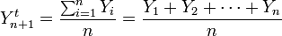
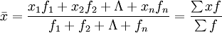
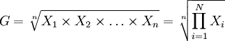
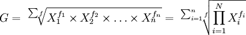
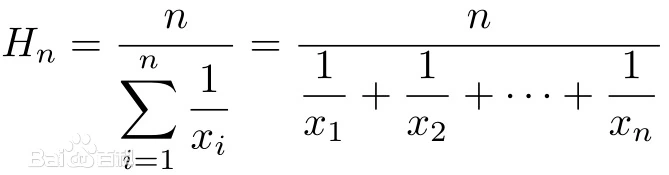


### 获取描述统计信息
描述统计信息主要包括数据的集中趋势、离散程度和频数分析等，其中集中趋势主要看均值和中位数，离散程度可以看极值、方差、标准差等，  
详细的内容大家可以阅读 [《统计思维系列课程01：解读数据》](https://zhuanlan.zhihu.com/p/595273755) 。

#### 基本概念
1. 均值
   1. 算术平均值(简单算术平均): 它是一组数据之和，除以这组数据的个数。  
      公式：   
   2. 加权平均值: 依据各个数据的重要性系数(即权重)进行相乘后再相加求和，就是加权和。加权和与所有权重之和的比等于加权算术平均数。   
       公式(这里的 f 表示频率):   
   3. 几何平均值: n个变量值连乘积的n次方根。  
      公式：   
   4. 加权几何平均值: 各标志值 fi 次方的连乘积的次方根。  
      公式：   
      当数据最终结果是一个和时，用算术平均数更合适，当数据最终结果是一个积时，用几何平均数更加合适。  
      所以一般在算增长率的时候，用几何平均数更加合适。
   5. 调和平均值，又称倒数平均数:是总体各统计变量倒数的算术平均数的倒数。  
      公式：   
   6. 平方平均数（quadratic mean），又名均方根（Root Mean Square），是指一组数据的平方的平均数的算术平方根。  
      公式：   

   对同一数据。调和平均值<=几何平均值<=算术平均值<=平方。  

2. 中位数
   - 中位数（Median），是将数据按照升序或降序排列后位于中间的数，它描述了数据的中等水平。
   - 如果数据体量有偶数个，则通常取最中间的两个数值的平均数作为中位数。
   - 四分位数就是排序后位于25%和75%位置上的数，较小的那个分位数称为“下四分位数”，通常记作Q1 ，较大的那个分位数称为“上四分位数”，通常记作Q3。
   - 很显然，中位数就是50%分位数，因此中位数也可以记作 Q2。

3. 众数
   - 众数是数据集合中出现频次最多的数据，它代表了数据的一般水平。
   - 如果数据没有明显的集中趋势，那么众数很有可能就不存在；如果数据非常集中，众数的代表性就会很好。
   - 众数一般不会受到极端值的影响，但是无法保证唯一性和存在性。


均值、中位数和众数的优缺点如下表所示。

名称 | 优点	| 缺点
--- | --- | ---
均值	| 充分利用了所有数据，适应性强	| 容易受到极端值（异常值）的影响
中位数	| 不容易被极端值（异常值）影响	| 对数据的变化不敏感
众数	| 能够很好的反映数据的集中趋势	| 有可能不存在（更适合定性数据）

均值是一组【常规】样本【大概率上】最能够反应整体情况的了。但遇上偏态分布时，会有点失灵。  
中位数可以用来弥补平均数在偏态分布中的不足之处。通常会在样本出现少数离群值的时候，用于提供相对尊重样本主要情况统计量。  
平均数和中位数都是用来尽可能反映样本整体情况。而众数则反映的是局部特征——一组样本在哪里最密集。


```Python
array1 = np.random.randint(1, 100, 10)
array1
```

输出：

```
array([46, 51, 15, 42, 53, 71, 20, 62,  6, 94])
```

**计算总和、均值和中位数。**

代码：

```Python
print(array1.sum())
print(np.sum(array1))
print(array1.mean())
print(np.mean(array1))
print(np.median(array1))
print(np.quantile(array1, 0.5))
```

> **说明**：上面代码中的`mean`、`median`和`quantile`分别是 NumPy 中计算算术平均值、中位数和分位数的函数，其中`quantitle`函数的第二个参数设置为0.5表示计算50%分位数，也就是中位数。

输出：

```
460
460
46.0
46.0
48.5
48.5
```

**极值、全距和四分位距离。**

代码：

```Python
print(array1.max())
print(np.amax(array1))
print(array1.min())
print(np.amin(array1))
print(array1.ptp())
print(np.ptp(array1))
q1, q3 = np.quantile(array1, [0.25, 0.75])
print(q3 - q1)
```

输出：

```
94
94
6
6
88
88
34.25
```

**方差、标准差和变异系数。**

代码：

```Python
print(array1.var())
print(np.var(array1))
print(array1.std())
print(np.std(array1))
print(array1.std() / array1.mean())
```

输出：

```
651.2
651.2
25.51862065237853
25.51862065237853
0.5547526228777941
```

**绘制箱线图。**

箱线图又称为盒须图，是显示一组数据分散情况的统计图，因形状如箱子而得名。 它主要用于反映原始数据分布的特征，还可以进行多组数据分布特征的比较。

代码：

```Python
plt.boxplot(array1, showmeans=True)
plt.ylim([-20, 120])
plt.show()
```

输出：


值得注意的是，对于二维或更高维的数组，在获取描述统计信息时，可以通过名为`axis`的参数指定均值、方差等运算是沿着哪一个轴来执行，`axis`参数不同，执行的结果可能是大相径庭的，如下所示。

代码：

```Python
array2 = np.random.randint(60, 101, (5, 3))
array2
```

输出：

```
array([[72, 64, 73],
       [61, 73, 61],
       [76, 85, 77],
       [97, 88, 90],
       [63, 93, 82]])
```

代码：

```Python
array2.mean()
```

输出：

```
77.0
```

代码：

```Python
array2.mean(axis=0)
```

输出：

```
array([73.8, 80.6, 76.6])
```

代码：

```Python
array2.mean(axis=1)
```

输出：

```
array([69.66666667, 65.        , 79.33333333, 91.66666667, 79.33333333])
```

代码：

```Python
array2.max(axis=0)
```

输出：

```
array([97, 93, 90])
```

代码：

```Python
array2.max(axis=1)
```

输出：

```
array([73, 73, 85, 97, 93])
```

再看看绘制箱线图，对于二维数组每一列都会产生一个统计图形，如下所示。

代码：

```Python
plt.boxplot(array2, showmeans=True)
plt.ylim([-20, 120])
plt.show()
```

输出：


> **说明**：箱线图中的小圆圈用来表示离群点，也就是大于$\small{Q_3 + 1.5 \times IQR}$或小于$\small{Q_1 - 1.5 \times IQR}$的值。公式中的常量`1.5`可以通过绘制箱线图的`boxplot`函数的`whis`参数进行修改，常用的值是`1.5`和`3`，修改为`3`通常是为了标识出极度离群点。

需要说明的是，NumPy 的数组对象并没有提供计算几何平均值、调和平均值、去尾平均值等的方法，如果有这方面的需求，可以使用名为 scipy 的三方库，它的`stats`模块中提供了这些函数。此外，该模块还提供了计算众数、变异系数、偏态、峰度的函数，代码如下所示。

代码：

```python
from scipy import stats

print(np.mean(array1))                # 算术平均值
print(stats.gmean(array1))            # 几何平均值
print(stats.hmean(array1))            # 调和平均值
print(stats.tmean(array1, [10, 90]))  # 去尾平均值
print(stats.variation(array1))        # 变异系数
print(stats.skew(array1))             # 偏态系数
print(stats.kurtosis(array1))         # 峰度系数
```

输出：

```
46.0
36.22349548825599
24.497219530825497
45.0
0.5547526228777941
0.11644192634527782
-0.7106251396024126
```

#### 其他相关方法概述

1. `all()` / `any()`方法：判断数组是否所有元素都是`True` / 判断数组是否有为`True`的元素。

2. `astype()`方法：拷贝数组，并将数组中的元素转换为指定的类型。

3. `reshape()`方法：调整数组对象的形状。

4. `dump()`方法：保存数组到二进制文件中，可以通过 NumPy 中的`load()`函数从保存的文件中加载数据创建数组。

   代码：

    ```Python
    array.dump('array1-data')
    array3 = np.load('array1-data', allow_pickle=True)
    array3
    ```

   输出：

    ```
    array([46, 51, 15, 42, 53, 71, 20, 62,  6, 94])
    ```

5. `tofile()`方法：将数组对象写入文件中。

   ```Python
   array1.tofile('res/array.txt', sep=',')
   ```

6. `fill()`方法：向数组中填充指定的元素。

7. `flatten()`方法：将多维数组扁平化为一维数组。

   代码：

    ```Python
    array2.flatten()
    ```

   输出：

    ```
    array([1, 2, 3, 4, 5, 6, 7, 8, 9])
    ```

8. `nonzero()`方法：返回非0元素的索引。

9. `round()`方法：对数组中的元素做四舍五入操作。

10. `sort()`方法：对数组进行就地排序。

    代码：

    ```Python
    array1.sort()
    array1
    ```

    输出：

    ```
    array([ 6, 15, 20, 42, 46, 51, 53, 62, 71, 94])
    ```

11. `swapaxes()`和`transpose()`方法：交换数组指定的轴和转置。

    代码：

    ```Python
    array2.swapaxes(0, 1)
    ```

    输出：

    ```
    array([[1, 4, 7],
           [2, 5, 8],
           [3, 6, 9]])
    ```

    代码：

    ```Python
    array2.transpose()
    ```

    输出：

    ```
    array([[1, 4, 7],
           [2, 5, 8],
           [3, 6, 9]])
    ```

12. `tolist()`方法：将数组转成 Python 中的`list`。

    代码：

    ```Python
    print(array2.tolist())
    print(type(array2.tolist()))
    ```

    输出：

    ```
    [[1, 2, 3], [4, 5, 6], [7, 8, 9]]
    <class 'list'>
    ```
