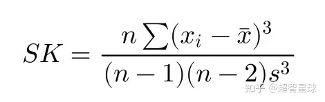
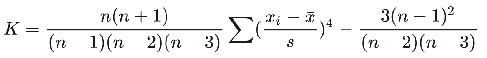
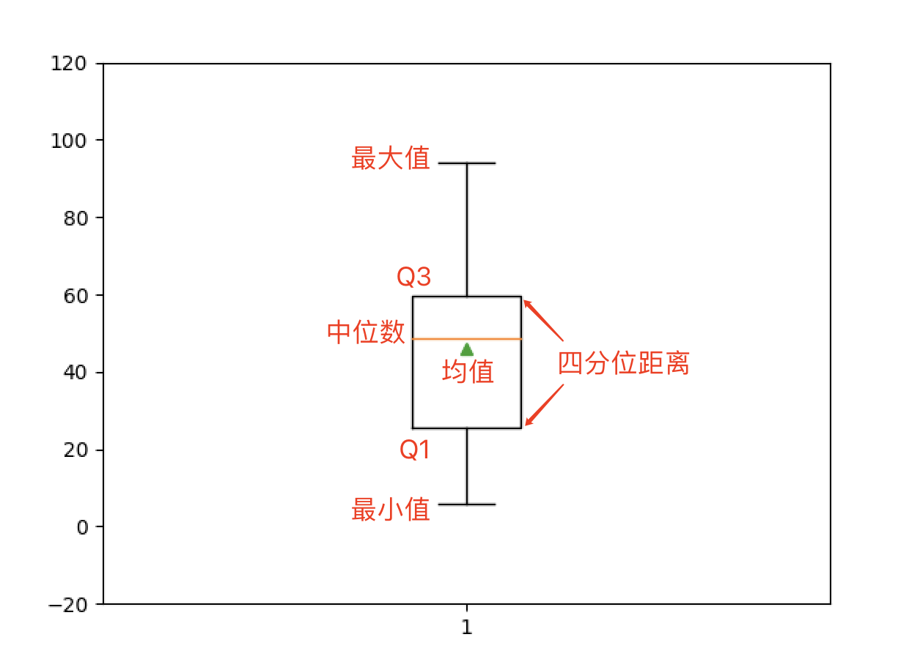


# 获取描述统计信息
描述统计信息主要包括数据的集中趋势、离散程度和频数分析等，其中集中趋势主要看均值和中位数，离散程度可以看极值、方差、标准差等，  
详细的内容大家可以阅读 [《统计思维系列课程01：解读数据》](https://zhuanlan.zhihu.com/p/595273755) 。

## 基本概念
### 1. 均值
   1. 算术平均值(简单算术平均): 它是一组数据之和，除以这组数据的个数。  
      公式：   
   2. 加权平均值: 依据各个数据的重要性系数(即权重)进行相乘后再相加求和，就是加权和。加权和与所有权重之和的比等于加权算术平均数。   
       公式(这里的 f 表示频率):   
   3. 几何平均值: n个变量值连乘积的n次方根。  
      公式：   
   4. 加权几何平均值: 各标志值 fi 次方的连乘积的次方根。  
      公式：   
      当数据最终结果是一个和时，用算术平均数更合适，当数据最终结果是一个积时，用几何平均数更加合适。  
      所以一般在算增长率的时候，用几何平均数更加合适。
   5. 调和平均值，又称倒数平均数:是总体各统计变量倒数的算术平均数的倒数。  
      公式：   
   6. 平方平均数（quadratic mean），又名均方根（Root Mean Square），是指一组数据的平方的平均数的算术平方根。  
      公式：   

   对同一数据。调和平均值<=几何平均值<=算术平均值<=平方。  

### 2. 中位数
   - 中位数（Median），是将数据按照升序或降序排列后位于中间的数，它描述了数据的中等水平。
   - 如果数据体量有偶数个，则通常取最中间的两个数值的平均数作为中位数。
   - 四分位数就是排序后位于25%和75%位置上的数，较小的那个分位数称为“下四分位数”，通常记作Q1 ，较大的那个分位数称为“上四分位数”，通常记作Q3。
   - 很显然，中位数就是50%分位数，因此中位数也可以记作 Q2。

### 3. 众数
   - 众数是数据集合中出现频次最多的数据，它代表了数据的一般水平。
   - 如果数据没有明显的集中趋势，那么众数很有可能就不存在；如果数据非常集中，众数的代表性就会很好。
   - 众数一般不会受到极端值的影响，但是无法保证唯一性和存在性。


### 均值、中位数和众数的优缺点如下表所示

名称 | 优点	| 缺点
--- | --- | ---
均值	| 充分利用了所有数据，适应性强	| 容易受到极端值（异常值）的影响
中位数	| 不容易被极端值（异常值）影响	| 对数据的变化不敏感
众数	| 能够很好的反映数据的集中趋势	| 有可能不存在（更适合定性数据）

均值是一组【常规】样本【大概率上】最能够反应整体情况的了。但遇上偏态分布时，会有点失灵。  
中位数可以用来弥补平均数在偏态分布中的不足之处。通常会在样本出现少数离群值的时候，用于提供相对尊重样本主要情况统计量。  
平均数和中位数都是用来尽可能反映样本整体情况。而众数则反映的是局部特征——一组样本在哪里最密集。

有如下所示的A和B两组数据。

    A组：3, 4, 5, 6, 6, 6, 6, 8, 10, 546
    B组：3, 4, 5, 5, 6, 6, 9, 10, 15

A组的均值：60，中位数：6，众数：6。  
B组的均值：7，中位数：6，众数：5, 6。  
可以看出，由于一个极端值，A组的均值会大幅度提升，但中位数和众数却没有变化。  


## 数据的离散趋势
如果说数据的集中趋势，说明了数据最主要的特征；那么数据的离散趋势，则体现了这个特征的稳定性。  
用通俗的话讲，数据波动越小，均值的代表性就越强；数据波动越大，均值的代表性就越弱。

1. 极值  
   极值指的就是数据中的最大值（maximum）和最小值（minimum），他们代表了数据集的上限和下限。

2. 极差  
   极差又称“全距”（range），是一组数据中的最大观测值和最小观测值之差，记作`R`。  
   一般情况下，极差越大，离散程度越大，数据受极值的影响也越严重。

3. 四分位距离  
   四分位距离（inter-quartile range）是一组数据上四分位数和下四分位数之差，通常记为`IQR`。  
   四分位距离越小，说明数据中间50%的数据越集中；反之四分位距离越大，说明数据中间50%的数据越分散。  
   四分位距离不受极端值的影响，它的大小很好的反映了中位数对一组数据的代表程度。

4. 方差  
   方差（variance）是将数据集中的每个值与均值的偏差进行平方，然后除以总数据量得到的值。  
   简单来说就是表示数据与期望值的偏离程度。  
   方差越大，就意味着数据越不稳定、波动越剧烈，也就是说数据整体比较分散，呈现出离散的趋势；而方差越小，意味着数据越稳定、波动越平滑，也就是说代表着数据整体比较集中。
   设一组数据`x1`,`x2`,`x3`……`xn`中的平均数为`x`，则该组数据方差的计算公式为:  或者 

5. 标准差  
   标准差（standard deviation）是将方差进行平方根运算后的结果，与方差一样都是表示数据与期望值的偏离程度。

6. 变异系数  
   变异系数（coefficient of variation，CV）又称离散系数、变差系数，是一组数据离散程度的一种归一化量度，  
   其定义为: `标准差`➗`平均值`  
   变异系数只在平均值不为零时有定义，而且一般适用于平均值大于零的情况。  
   变异系数也被称为标准离差率或单位风险。  
   变异系数没有量纲，因此在比较两组量纲不同或均值不同的数据时，它比标准差更具参考性。

7. 标准分数   
   有了均值和标准差之后，可以给数据中的每个值计算标准分数（standard score）  
   标准分数可以表示每个数值在一组数据中的相对位置并帮助我们判断是否有离群点。  
   标准分数只是对原始数据进行了线性变换，并没有改变某个数值在该组数据中的位置，也没有改变改组数据分布的轮廓。  
   将上面的公式作用于一组数据的过程称为数据的标准化。

## 数据的频数分析
频数分析是用一定的方式将数据分组，然后统计每个分组中样本的数量，再辅以图表（如直方图）直观展示数据分布趋势的一种方法。  
频数分析的业务意义包括：
1. 大问题变小问题，迅速聚焦到需要关注的群体。
2. 找到合理的分类机制，有利于长期的数据分析。

## 偏态和峰度
如果我们在直方图上再拟合出一条曲线与正态曲线进行比较，比较的重点是曲线的尖峭程度和对称性，我们可以将其称之为`峰度`和`偏态`。  
数据分布的不对称性称为`偏态`，偏态又分为`正偏（positive skew）`或`负偏（negative skew）`两种。  
在正态分布的情况下，均值、中位数、众数应该都在对称轴的位置，如果众数和中位数在左边，均值在右边，那么数据的极端值也在右边，数据分布曲线向右延伸，就是我们说的`正偏（右偏）`；  
如果均值在左边，中位数和众数在右边，那么数据的极端值在左边，数据分布曲线向左延伸，就是我们说的`负偏（左偏）`  

测定偏态的指标是`偏态系数(coefficient of skewness)`,记作SK，Excel 中计算偏态系数的函数是`SKEW`，对应的公式如:
  
式中，s^3是样本标准差的三次方。

SK > 0 时，分布呈现正偏， SK 值越大，正偏程度越高。  
SK < 0 时，分布呈现负偏， SK 值越小，负偏程度越高。  

`峰度（peakedness;kurtosis）`是指数据分布的尖峭程度，一般可以表现为尖顶峰度、平顶峰度和标准峰度（正态分布的峰度）。  
测定峰度的指标是`峰度系数`，Excel 中计算峰度系数的函数是`KURT`，对应的公式如下所示：
  

峰度系数 K < 0 时，分布与正态分布相比更为扁平、宽肩、瘦尾；  
峰度系数 K > 0 时，分布与正态分布相比更为尖峰、瘦肩、肥尾。


```Python
import numpy as np
# 生成 1～100 之间的 10 个随机整数
array1 = np.random.randint(1, 100, 10)
print(repr(array1))  # 打印: array([20, 53, 24, 42, 43, 90, 70, 48, 99, 18])

# 计算总和、均值和中位数
print(array1.sum())   # 计算总和，打印: 507
print(np.sum(array1)) # 计算总和，打印: 507
print(array1.mean())   # 计算算术平均值，打印: 50.7
print(np.mean(array1)) # 计算算术平均值，打印: 50.7
print(np.median(array1))  # 中位数，打印: 45.5
print(np.quantile(array1, 0.5))  # 分位数，第二个参数设置为0.5表示计算50%分位数，也就是中位数。打印: 45.5

# 极值、全距和四分位距离
print(array1.max())    # 最大值，打印: 99
print(np.amax(array1)) # 最大值，打印: 99
print(array1.min())    # 最小值，打印: 18
print(np.amin(array1)) # 最小值，打印: 18
print(array1.ptp())    # 全距，打印: 81
print(np.ptp(array1))  # 全距，打印: 81
q1, q3 = np.quantile(array1, [0.25, 0.75])  # 获取 25%分位数 和 75%分位数
print(q3 - q1)         # 四分位距离，打印: 37.25

# 方差、标准差和变异系数
print(array1.var())    # 方差，打印: 712.2099999999999
print(np.var(array1))  # 方差，打印: 712.2099999999999
print(array1.std())    # 标准差，打印: 26.687262879508644
print(np.std(array1))  # 标准差，打印: 26.687262879508644
print(array1.std() / array1.mean())  # 变异系数，打印: 0.5263759936786715
```


**绘制箱线图。**

箱线图又称为盒须图，是显示一组数据分散情况的统计图，因形状如箱子而得名。  
它主要用于反映原始数据分布的特征，还可以进行多组数据分布特征的比较。

```Python
import numpy as np
import matplotlib.pyplot as plt
array1 = np.random.randint(1, 100, 10)

plt.boxplot(array1, showmeans=True)
plt.ylim([-20, 120])
plt.show()
```



## axis 指定轴
值得注意的是，对于二维或更高维的数组，在获取描述统计信息时，可以通过名为`axis`的参数指定均值、方差等运算是沿着哪一个轴来执行，`axis`参数不同，执行的结果可能是大相径庭的，如下所示。

```Python
import numpy as np
array2 = np.random.randint(60, 101, (5, 3))
print(repr(array2))
'''打印:
array([[72, 64, 73],
       [61, 73, 61],
       [76, 85, 77],
       [97, 88, 90],
       [63, 93, 82]])
'''

print(array2.mean())   # 总体算术平均值，打印: 77.0
print(repr(array2.mean(axis=0)))   # 按列计算平均值，打印: array([73.8, 80.6, 76.6])
print(repr(array2.mean(axis=1)))   # 按行计算平均值，打印: array([69.66666667, 65.        , 79.33333333, 91.66666667, 79.33333333])

print(array2.max())   # 全体最大值，打印: 97
print(repr(array2.max(axis=0)))   # 按列取最大值，打印: array([97, 93, 90])
print(repr(array2.max(axis=1)))   # 按行取最大值，打印: array([73, 73, 85, 97, 93])

```


再看看绘制箱线图，对于二维数组每一列都会产生一个统计图形，如下所示。

代码：

```Python
plt.boxplot(array2, showmeans=True)
plt.ylim([-20, 120])
plt.show()
```

输出：


> **说明**：箱线图中的小圆圈用来表示离群点，也就是大于$\small{Q_3 + 1.5 \times IQR}$或小于$\small{Q_1 - 1.5 \times IQR}$的值。公式中的常量`1.5`可以通过绘制箱线图的`boxplot`函数的`whis`参数进行修改，常用的值是`1.5`和`3`，修改为`3`通常是为了标识出极度离群点。

需要说明的是，NumPy 的数组对象并没有提供计算几何平均值、调和平均值、去尾平均值等的方法，如果有这方面的需求，可以使用名为 scipy 的三方库，它的`stats`模块中提供了这些函数。此外，该模块还提供了计算众数、变异系数、偏态、峰度的函数，代码如下所示。

代码：

```python
from scipy import stats

print(np.mean(array1))                # 算术平均值
print(stats.gmean(array1))            # 几何平均值
print(stats.hmean(array1))            # 调和平均值
print(stats.tmean(array1, [10, 90]))  # 去尾平均值
print(stats.variation(array1))        # 变异系数
print(stats.skew(array1))             # 偏态系数
print(stats.kurtosis(array1))         # 峰度系数
```

输出：

```
46.0
36.22349548825599
24.497219530825497
45.0
0.5547526228777941
0.11644192634527782
-0.7106251396024126
```

#### 其他相关方法概述

1. `all()` / `any()`方法：判断数组是否所有元素都是`True` / 判断数组是否有为`True`的元素。

2. `astype()`方法：拷贝数组，并将数组中的元素转换为指定的类型。

3. `reshape()`方法：调整数组对象的形状。

4. `dump()`方法：保存数组到二进制文件中，可以通过 NumPy 中的`load()`函数从保存的文件中加载数据创建数组。

   代码：

    ```Python
    array.dump('array1-data')
    array3 = np.load('array1-data', allow_pickle=True)
    array3
    ```

   输出：

    ```
    array([46, 51, 15, 42, 53, 71, 20, 62,  6, 94])
    ```

5. `tofile()`方法：将数组对象写入文件中。

   ```Python
   array1.tofile('res/array.txt', sep=',')
   ```

6. `fill()`方法：向数组中填充指定的元素。

7. `flatten()`方法：将多维数组扁平化为一维数组。

   代码：

    ```Python
    array2.flatten()
    ```

   输出：

    ```
    array([1, 2, 3, 4, 5, 6, 7, 8, 9])
    ```

8. `nonzero()`方法：返回非0元素的索引。

9. `round()`方法：对数组中的元素做四舍五入操作。

10. `sort()`方法：对数组进行就地排序。

    代码：

    ```Python
    array1.sort()
    array1
    ```

    输出：

    ```
    array([ 6, 15, 20, 42, 46, 51, 53, 62, 71, 94])
    ```

11. `swapaxes()`和`transpose()`方法：交换数组指定的轴和转置。

    代码：

    ```Python
    array2.swapaxes(0, 1)
    ```

    输出：

    ```
    array([[1, 4, 7],
           [2, 5, 8],
           [3, 6, 9]])
    ```

    代码：

    ```Python
    array2.transpose()
    ```

    输出：

    ```
    array([[1, 4, 7],
           [2, 5, 8],
           [3, 6, 9]])
    ```

12. `tolist()`方法：将数组转成 Python 中的`list`。

    代码：

    ```Python
    print(array2.tolist())
    print(type(array2.tolist()))
    ```

    输出：

    ```
    [[1, 2, 3], [4, 5, 6], [7, 8, 9]]
    <class 'list'>
    ```
